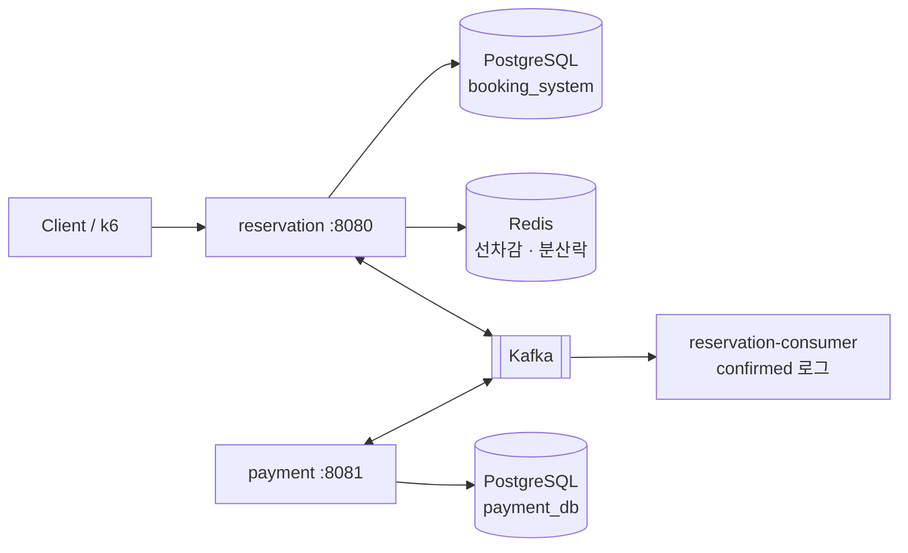
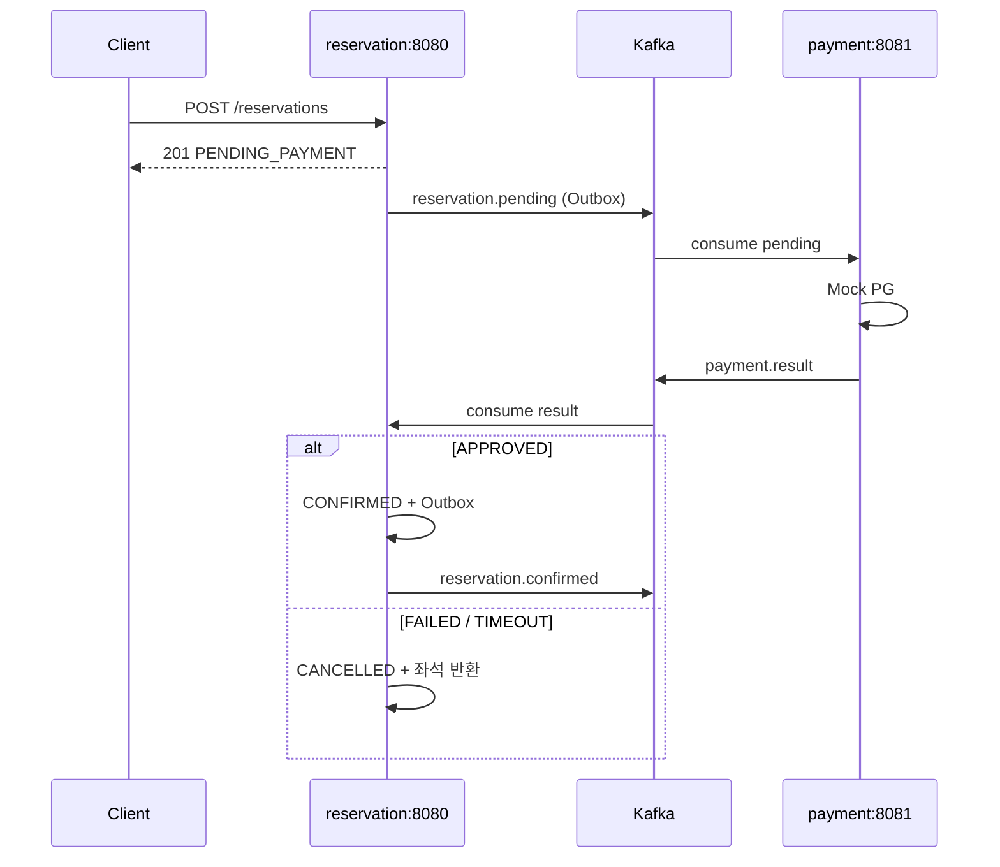

## 선착순 이벤트 예약

콘서트 티켓이나 선착순 접수처럼, **자리 수는 정해져 있는데 많은 사람이 한꺼번에 신청**하는 상황을 가정합니다.

이벤트마다 받을 수 있는 최대 인원(`capacity`)이 있고, 예약이 하나 들어올 때마다 남은 자리는 하나씩 줄어듭니다.  
같은 상황에서도 **예약을 처리하는 방법**을 여러 가지로 바꿔 보며, 어떤 방식이 더 안정적인지 비교해 볼 수 있습니다.
## System Architecture (standard + 결제 Saga)

Compose 기본 경로(`APP_MODE=standard`, `PAYMENT_ENABLED=true`) 기준입니다.



| 구성요소 | 역할 |
|----------|------|
| **reservation** | 멱등·중복검사·재고·락·Outbox·Saga 소비·reaper |
| **payment** | Mock PG · `payment_db` · `payment.result` Outbox |
| **Kafka** | `reservation.pending` / `payment.result` / `reservation.confirmed` |
| **Redis** | reservation만 사용 (재고 선차감 · `REDIS` 전략 시 분산 락) |
| **contracts** | 위 이벤트 DTO만 공유 (도메인/DB 공유 없음) |

**scale-out (`--profile scale3`):** Nginx 뒤에 reservation API 3대. 인프라 스케일 뷰는 [`docs/architecture.png`](docs/architecture.png) (단일 API 시대 다이어그램 — payment 미반영).

| 모드 | 환경변수 | 목적 |
|------|----------|------|
| **standard** (기본) | `APP_MODE=standard` | 운영형 — 멱등·Outbox·Redis 선차감·(Compose) 결제 Saga |
| **basic** | `APP_MODE=basic` | 락 4종 비교 실험실 (멱등/Outbox/결제 없음) |

### 결제 Saga 흐름



**서비스 분리 근거:** 예약은 자기 DB 안에서 정합성(락·재고)을 지키고, 결제는 통제 불가능한 외부(PG)와 통신한다. 트랜잭션 경계·실패 모델이 달라 **choreography Saga + 보상 트랜잭션**으로 묶는다.

**알려진 한계:** reaper가 먼저 `CANCELLED`로 만든 뒤 늦은 `APPROVED`가 오면 결제만 성공·좌석은 없는 드문 불일치가 생길 수 있다. 실무에서는 payment 환불 보상이 필요하다.  
payment의 Mock PG 호출은 **DB 트랜잭션 밖**(PENDING 커밋 → PG → 결과+Outbox)이다. TX 사이 크래시 시 PENDING orphan 재처리는 랩 범위 밖이다.

설계 상세: [`docs/superpowers/specs/2026-07-08-payment-saga-msa-design.md`](docs/superpowers/specs/2026-07-08-payment-saga-msa-design.md)

## Docker 환경에서 테스트하기

### 사전 준비

- [Docker Desktop](https://www.docker.com/products/docker-desktop/) (또는 Docker Engine + Compose v2)
- 포트 사용 가능 여부: `5432`, `6379`, `8080`, `9092`, `9094`, `80`(scale3)

### 실행 방식 선택

| 방식 | Compose 파일 | 용도 |
|------|--------------|------|
| **Full stack** | `docker-compose.yml` | 앱·DB·Redis·Kafka·Consumer를 컨테이너로 한 번에 실행 (k6·scale3 포함) |
| **Infra only** | `docker-compose.infra.yml` | DB·Redis·Kafka만 Docker, 앱은 IDE/`./gradlew bootRun` |

---

### 1) Full stack — standard (기본)

앱 + Postgres + Redis + Kafka + Consumer를 모두 컨테이너로 띄웁니다.

```bash
docker compose --profile single up -d --build
./scripts/reset-standard.sh
```

동작 확인:

```bash
# 헬스체크
curl http://localhost:8080/actuator/health

# 이벤트 잔여 좌석 조회 (시드 데이터 event id=1)
curl http://localhost:8080/api/v1/events/1

# 예약 생성 (standard: 멱등·Outbox·Redis 재고 포함)
curl -X POST http://localhost:8080/api/v1/reservations \
  -H "Content-Type: application/json" \
  -H "X-Idempotency-Key: test-key-1" \
  -d '{"eventId": 1, "userId": "user-1"}'
# PAYMENT_ENABLED=true → status=PENDING_PAYMENT, 수 초 후 GET으로 CONFIRMED 확인
```

Saga E2E (happy path / 결제 거절 / PG 타임아웃):

```bash
# happy path — PENDING_PAYMENT → CONFIRMED
curl -X POST http://localhost:8080/api/v1/reservations \
  -H "Content-Type: application/json" -H "X-Idempotency-Key: saga-1" \
  -d '{"eventId": 1, "userId": "user-saga-1"}'
curl http://localhost:8080/api/v1/reservations/{id}

# 결제 거절 — userId fail- prefix → CANCELLED + 좌석 반환
curl -X POST http://localhost:8080/api/v1/reservations \
  -H "Content-Type: application/json" \
  -d '{"eventId": 1, "userId": "fail-user-1"}'

# PG 타임아웃 — userId timeout- prefix → FAILED(TIMEOUT) → CANCELLED
curl -X POST http://localhost:8080/api/v1/reservations \
  -H "Content-Type: application/json" \
  -d '{"eventId": 1, "userId": "timeout-user-1"}'
```

k6 결제 Saga (Compose 기동 후):

```bash
docker compose run --rm k6 run /scripts/standard/payment-saga.js

# 결제 실패 30% 재고 정합
PG_FAILURE_RATE=0.3 docker compose up -d --no-deps --build payment
docker compose run --rm k6 run /scripts/standard/payment-failure.js
```

종료:

```bash
docker compose --profile single down
```

---

### 2) Full stack — basic (Lock Handler 비교)

4종 락 전략(`NONE`, `OPTIMISTIC`, `PESSIMISTIC`, `REDIS`) 동작·k6 부하 비교용입니다.

```bash
APP_MODE=basic docker compose --profile single up -d --build
./scripts/reset-basic.sh
```

락 전략 지정 예:

```bash
curl -X POST "http://localhost:8080/api/v1/reservations?lockStrategy=NONE" \
  -H "Content-Type: application/json" \
  -d '{"eventId": 1, "userId": "user-none-1"}'
```

k6 4종 비교 (컨테이너 내부에서 실행):

```bash
docker compose run --rm k6 run /scripts/benchmark/05-compare-all.js
```

---

### 3) Infra only — IDE / bootRun

인프라만 Docker로 띄우고 앱은 호스트에서 실행합니다. Kafka는 호스트 접근용 `localhost:9094` 리스너를 사용합니다.

```bash
docker compose -f docker-compose.infra.yml up -d
cp .env.local .env   # IDE가 .env를 읽는 경우
KAFKA_BOOTSTRAP_SERVERS=localhost:9094 ./gradlew bootRun
```

데이터 초기화 (infra compose 사용 시 `-f` 필요):

```bash
docker compose -f docker-compose.infra.yml exec postgres psql -U lab -d booking_system -c \
  "UPDATE events SET reserved_count = 0, version = 0 WHERE id = 1;
   TRUNCATE reservation_outbox, idempotency_records, reservations;"
docker compose -f docker-compose.infra.yml exec redis redis-cli SET event:1:remaining 100
```

종료 (DB 볼륨까지 삭제):

```bash
docker compose -f docker-compose.infra.yml down -v
```

---

### 4) Scale-out (API 3대 + Nginx)

분산 락·로드밸런싱 실험:

```bash
docker compose --profile scale3 up -d --build
./scripts/reset-standard.sh
curl http://localhost/api/v1/events/1
```

k6 scale-out:

```bash
docker compose run --rm k6 run -e LOCK_STRATEGY=REDIS /scripts/benchmark/06-scale-out.js
```

---

### 5) Kafka · Consumer 확인

Full stack 기동 후 Consumer 로그:

```bash
docker compose logs -f reservation-consumer
```

Kafka 토픽 메시지 확인:

```bash
docker compose exec kafka kafka-console-consumer \
  --bootstrap-server localhost:9092 \
  --topic reservation.confirmed \
  --from-beginning
```

> Infra only compose(`docker-compose.infra.yml`) 사용 시 bootstrap은 `localhost:9094`입니다.

---

### 6) 단위·통합 테스트 (Docker 불필요)

Testcontainers가 Postgres·Redis를 자동 기동합니다.

```bash
./gradlew test
```

---

### 트러블슈팅

| 증상 | 확인 |
|------|------|
| `connection refused` (8080) | `docker compose ps` — `app` 컨테이너 기동 여부 |
| Kafka 연결 실패 (bootRun) | `KAFKA_BOOTSTRAP_SERVERS=localhost:9094` 사용 여부 |
| REDIS 전략만 실패 | `docker compose logs redis`, Redis 연결 설정 |
| 포트 충돌 | 로컬 Postgres/Redis/Kafka가 이미 5432·6379·9092 사용 중인지 확인 |

상세 시나리오: [`docs/test-scenarios.md`](docs/test-scenarios.md) · 코드베이스 가이드: [`AGENT.md`](AGENT.md)

<br>
<br>

## k6 벤치마크 요약 (AWS)

`SPRING_PROFILES_ACTIVE=aws` · RDS · ElastiCache · MSK · ALB 뒤 API에 k6를 실행한 결과.
예약 **100**개에 대한 레이스 컨디션

### basic — Lock Handler 4종 (`01`~`04`, 동시 200건)

| 전략 | 201 | 409 | p95 | reservedCount | 예약 |
|------|-----|-----|-----|---------------|------|
| NONE | 132 | 18 | 88ms | **132** | ❌ 초과 예약 |
| OPTIMISTIC | 100 | 100 | 115ms | 100 | ✅ |
| PESSIMISTIC | 100 | 100 | 340ms | 100 | ✅ |
| REDIS | 100 | 100 | 168ms | 100 | ✅ |

→ **정확성:** NONE만 초과 예약 · **지연:** PESSIMISTIC(행 잠금) > REDIS > OPTIMISTIC

### basic k6 Scale-out test (REDIS 분산 락)

| 구성 | 201 | p95 | reservedCount |
|------|-----|-----|---------------|
| API App 1대 | 100 | 165ms | 100 |
| API App 3대 + ALB | 100 | 138ms | 100 |


### standard k6

| 시나리오 | 조건 | 201 | 409 | 검증 |
|----------|------|-----|-----|------|
| **capacity** | 500 동시 · REDIS | 100 | 400 | ✅ 예약 준수 |
| **duplicate-user** | **같은 userId** 10회 | 1 | 9 | ✅ 1인 1예약 |
| **payment-saga** | 200 동시 · Saga on | 100 | 100 | ✅ 정착 후 reservedCount=100 |
| **payment-failure** | 200 동시 · PG_FAILURE_RATE=0.3 | 100 | 100 | ✅ 실패분 좌석 반환 · DB 정합 |

> payment-saga / payment-failure는 로컬 Docker Compose(`PAYMENT_ENABLED=true`) 기준. 실패 시나리오는 `integrity=PASS`(reservedCount + remainingCapacity = capacity)로 재고 정합을 확인한다.


