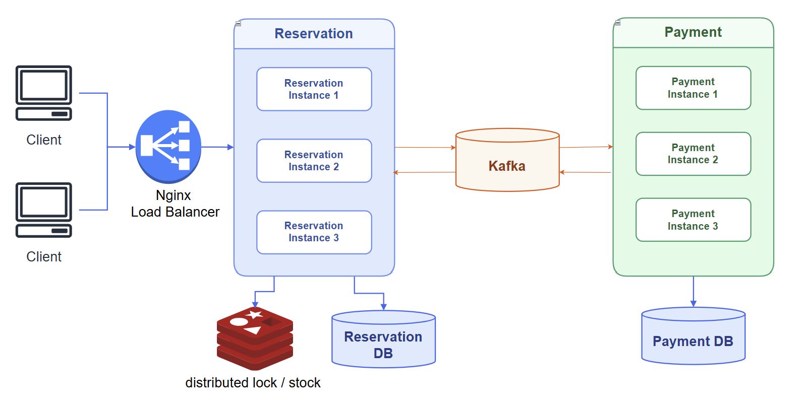
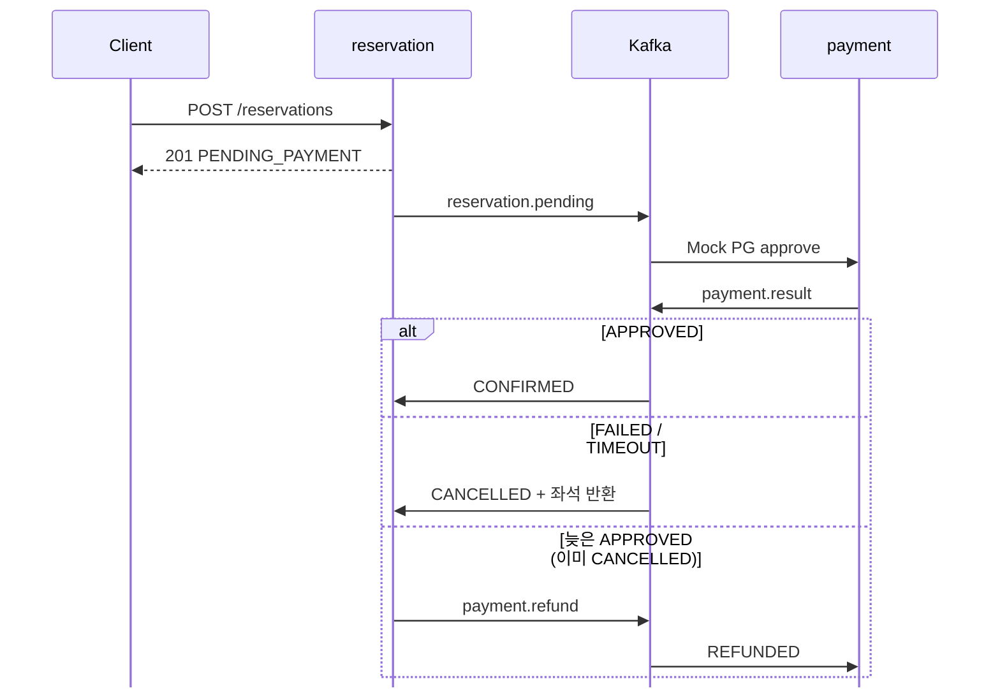

# 선착순 이벤트 예약 · 결제 Saga Lab

한정 좌석에 동시 요청이 몰릴 때 **초과 예약을 막고**, 외부 결제 실패·타임아웃·늦은 승인까지 **보상으로 정합을 맞추는** 백엔드 실험실입니다.

Kotlin · Spring Boot 3.4 · PostgreSQL · Redis · Kafka · Docker Compose · k6

---

## 풀고자 한 문제

| 상황 | 위험 | 이 랩에서의 대응 |
|------|------|------------------|
| 동시 예약 폭주 | capacity 초과(overselling) | 락 전략 비교 + Redis 선차감 |
| 결제 실패 / PG 타임아웃 | 좌석만 묶인 채 확정 불가 | choreography Saga + 좌석 보상 |
| reaper 취소 후 늦은 APPROVED | 결제만 성공 · 좌석 없음 | `payment.refund` → `REFUNDED` |

예약(재고·락)과 결제(외부 PG)는 **실패 모델이 달라** 한 트랜잭션으로 묶지 않고, Kafka 이벤트로 상태를 맞춥니다.

---

## 시스템 아키텍처

Compose 기본: `APP_MODE=standard`, `PAYMENT_ENABLED=true`  
scale-out: Nginx → Reservation ×3, Payment ×3 (Kafka choreography)



| | 역할 |
|--|------|
| **reservation** | 멱등 · 재고 · Outbox · Saga 소비 · reaper |
| **payment** | Mock PG · `payment_db` · 결과/환불 Outbox |
| **Kafka** | `pending` → `result` → (`refund`) → `confirmed` |
| **Redis** | 재고 선차감 · (REDIS 전략) 분산 락 |
| **contracts** | 이벤트 DTO만 공유 (DB/도메인 공유 없음) |



---

## 설계에서 고른 것

- **Choreography Saga** — 예약·결제 간 동기 HTTP 없음. 각자 DB, 이벤트만 공유.
- **Transactional Outbox** — DB 커밋과 Kafka 발행을 한 TX에 묶어 dual-write 구멍을 막음.
- **TX ↔ PG 분리** — Mock PG `approve`/`refund`는 DB 트랜잭션 밖. 커넥션을 sleep에 붙잡지 않음.
- **늦은 승인 환불** — reaper가 먼저 취소한 뒤 APPROVED가 오면 reservation이 환불을 요청하고 payment가 `REFUNDED`로 닫음.

모드: **standard**(운영형·기본) · **basic**(락 4종 비교 실험실). 상세 설계는 [결제 Saga 설계서](docs/superpowers/specs/2026-07-08-payment-saga-msa-design.md).

---

## 숫자로 증명 (k6)

### 동시성 — Lock 전략 (AWS · capacity 100 · 동시 200)

| 전략 | reservedCount | 결과 |
|------|---------------|------|
| NONE | **132** | ❌ 초과 예약 |
| OPTIMISTIC / PESSIMISTIC / REDIS | 100 | ✅ |

지연: PESSIMISTIC(행 잠금) > REDIS > OPTIMISTIC. Scale-out(API 3대+ALB)에서도 REDIS로 capacity 준수.

### Saga — 결제 경로 (로컬 Compose)

| 시나리오 | 검증 |
|----------|------|
| **payment-saga** | 정착 후 `reservedCount = 100` |
| **payment-failure** (실패 30%) | 실패분 좌석 반환 · `integrity=PASS` |

---

## Quick start

```bash
docker compose --profile single up -d --build
./scripts/reset-standard.sh

curl http://localhost:8080/actuator/health
curl -X POST http://localhost:8080/api/v1/reservations \
  -H "Content-Type: application/json" \
  -H "X-Idempotency-Key: demo-1" \
  -d '{"eventId": 1, "userId": "user-1"}'
# → PENDING_PAYMENT, 수 초 후 GET으로 CONFIRMED

./gradlew test
```

결제 거절·타임아웃은 `userId`에 `fail-` / `timeout-` prefix.  
전체 시나리오·k6·scale-out·트러블슈팅: [test-scenarios](docs/test-scenarios.md) · 코드맵: [AGENT.md](AGENT.md)
