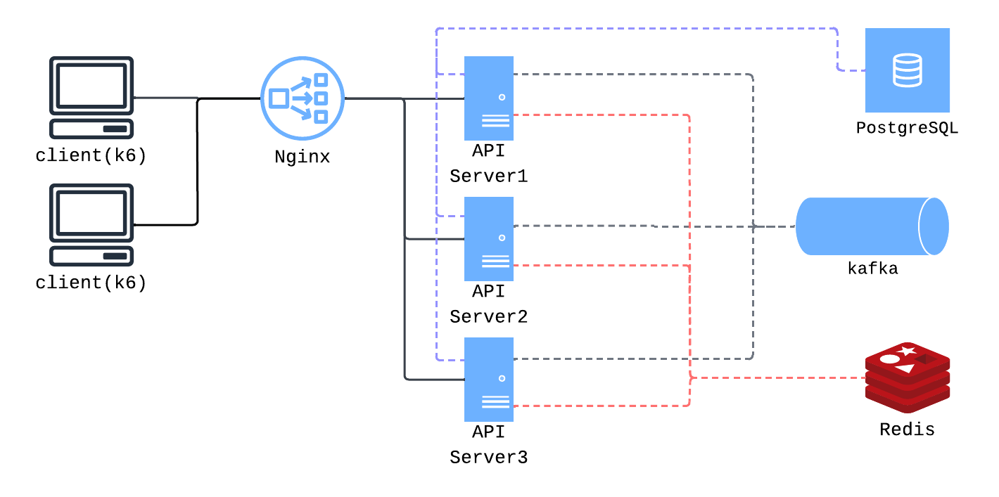

## 선착순 이벤트 예약

콘서트 티켓이나 선착순 접수처럼, **자리 수는 정해져 있는데 많은 사람이 한꺼번에 신청**하는 상황을 다룹니다.

이벤트마다 받을 수 있는 최대 인원(`capacity`)이 있고, 예약이 하나 들어올 때마다 남은 자리는 하나씩 줄어듭니다.  
같은 상황에서도 **예약을 처리하는 방법**을 여러 가지로 바꿔 보며, 어떤 방식이 더 안정적인지 비교해 볼 수 있습니다.

---
## System Architecture

k6/클라이언트 → Nginx → API 서버 3대 → PostgreSQL · Redis · Kafka.  

| 모드 | 환경변수 | 목적 |
|------|----------|------|
| **basic** | `APP_MODE=basic` | 의도적으로 단순화한 비교용 실행 모드 (4종 Lock Handler → DB → Kafka) |
| **standard** (기본) | `APP_MODE=standard` | 실무형 시나리오 검증 **AWS 환경에서 구동** |

---

## k6 벤치마크 요약 (AWS)

`SPRING_PROFILES_ACTIVE=aws` · RDS · ElastiCache · MSK · ALB 뒤 API에 k6를 실행한 결과.
예약 **100**개에 대한 레이스 컨디션

### basic — Lock Handler 4종 (`01`~`04`, 동시 200건 · NONE만 150건)

| 전략 | 201 | 409 | p95 | reservedCount | 예약 |
|------|-----|-----|-----|---------------|------|
| NONE | 132 | 18 | 88ms | **132** | ❌ 초과 예약 |
| OPTIMISTIC | 100 | 100 | 115ms | 100 | ✅ |
| PESSIMISTIC | 100 | 100 | 340ms | 100 | ✅ |
| REDIS | 100 | 100 | 168ms | 100 | ✅ |

→ **정확성:** NONE만 초과 예약 · **지연:** PESSIMISTIC(행 잠금) > REDIS > OPTIMISTIC

### basic k6 Scale-out test (REDIS 분산 락)

| 구성 | 201 | p95 | reservedCount |
|------|-----|-----|---------------|
| API App 1대 | 100 | 165ms | 100 |
| API App 3대 + ALB | 100 | 138ms | 100 |

### standard k6

| 시나리오 | 조건 | 201 | 409 | 검증 |
|----------|------|-----|-----|------|
| **capacity** | 500 동시 · REDIS | 100 | 400 | ✅ 예약 준수 |
| **duplicate-user** | **같은 userId** 10회 | 1 | 9 | ✅ 1인 1예약 |

